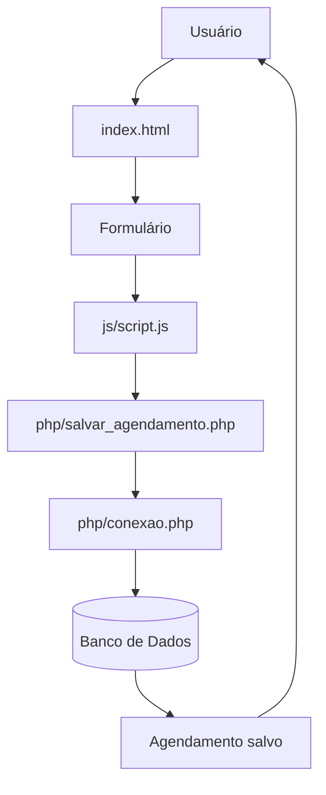
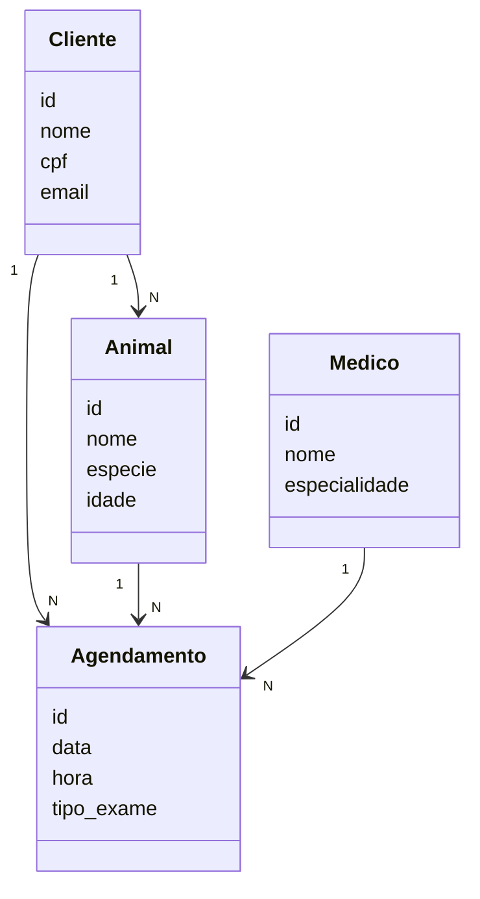

## Diagrama UML - Sistema de Agendamento

O desenvolvimento do sistema será realizado em etapas:

1. Configuração do ambiente utilizando XAMPP (Apache e MySQL).
2. Criação da estrutura do projeto no VS Code.
3. Desenvolvimento do front-end com HTML e CSS.
4. Criação do formulário de agendamento.
5. Implementação de validações com JavaScript.
6. Desenvolvimento do back-end com PHP.
7. Criação do banco de dados no MySQL.
8. Integração entre sistema e banco de dados.
9. Testes e validação do sistema.

##  Diagrama UML (Fluxo do Sistema)

## Diagrama de Classes

